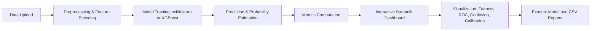

# CognitiveLens, Human-AI Decision Comparison Tool

**CognitiveLens** is an advanced analytics and interpretability framework built with **Python**, **Streamlit**, and **Plotly**, designed to explore how humans and AI systems make decisions and where they diverge.  
It bridges **data science**, **AI ethics**, and **visual storytelling**, offering a hands-on environment to analyze fairness, calibration, and alignment between human and model predictions.

---

## Motivation & Vision

In a world where **machine learning systems augment or replace human decision-making**, the key challenge is not just performance, it’s **trust, interpretability, and alignment**.

CognitiveLens empowers analysts, data scientists, and AI practitioners to **visualize decision overlap** between humans and machines, highlight fairness gaps, and gain insights into whether a model’s decisions are justifiable, consistent, and ethically sound.

> “When humans and machines disagree, insight begins.”

---

## Core Objectives

1. **Quantify AI–Human Alignment** | Evaluate how often the AI agrees with human decisions and measure consistency.  
2. **Evaluate Fairness** | Identify whether subgroups (gender, region, income level) show systematic performance differences.  
3. **Visualize Decision Logic** | Explore probabilities, ROC curves, and confusion matrices to interpret model behavior.  
4. **Enable Data Storytelling** | Transform ethical AI analysis into clear, narrative-driven visuals.  
5. **Empower Human Oversight** | Collect and analyze human judgments for model validation or retraining.

---

## Key Features

- **Human vs AI Agreement Metrics**  
  Understand model-human overlap via accuracy, Cohen’s κ, and decision congruence.  

- **Subgroup Fairness Auditing**  
  Analyze bias patterns across demographics using both categorical and numeric features (with automatic quantile binning).  

- **Confidence & Calibration Views**  
  Examine probability distributions, Brier scores, and model calibration curves.  

- **Explainable AI Foundations**  
  Designed for integration with SHAP, LIME, and counterfactual interpretation workflows.  

- **Survey Mode for Human Judgments**  
  Append new human-labeled cases directly into a local dataset for model evaluation.  

---

## Architecture Overview


This architecture promotes modularity, enabling users to extend CognitiveLens with new model types or integrate it into custom MLOps pipelines.

---

## Mathematical Foundations

| Metric | Formula | Interpretation |
|---------|----------|----------------|
| **Cohen’s κ** | κ = (p₀ − pₑ) / (1 − pₑ) | Measures agreement beyond chance between AI and human labels. |
| **Brier Score** | (1/N) Σ (ŷᵢ − yᵢ)² | Lower values mean better-calibrated probability predictions. |
| **ROC-AUC** | ∫ TPR(FPR) d(FPR) | Quantifies model’s ability to distinguish between classes. |
| **Fairness Gap** | Acc₁ − Acc₂ | Absolute difference in performance between subgroups. |

---

## Workflow Summary

1. **Upload CSV or Load Sample Data**
   - Each row represents a case or decision instance.  
   - Include columns: `human_label`, `y_true` (optional), and one sensitive attribute.

2. **Feature Preprocessing**
   - Automatic encoding for categorical data and scaling for numerics.  
   - Numeric fairness attributes automatically binned into quartiles for balanced comparison.

3. **Model Training**
   - Choose from Logistic Regression, Random Forest, or XGBoost (if installed).  
   - Uses sklearn pipelines for full reproducibility.

4. **Evaluation**
   - Visual dashboards display metrics, ROC curves, confusion matrices, and fairness comparisons.  

5. **Interpretation & Export**
   - Download trained `.joblib` model or `evaluation_rows.csv` for documentation or sharing.

---

## Visual Dashboard Walkthrough

### Agreement & Fairness Analysis
| Visualization | Description |
|---------------|--------------|
||Illustrates agreement between human and AI decisions across subgroups (gender). |
||Highlights performance and bias gaps between AI and human judgments by demographic categories. |

### Model Confidence & Calibration
| Visualization | Description |
|---------------|--------------|
||Visualizes model output probabilities, showing calibration and certainty. |
||Demonstrates model discrimination power with AUC metric. |

### Classification Insight
| Visualization | Description |
|---------------|--------------|
||Displays how often the AI predictions align or misalign with human decisions. |
||The full Streamlit interface showing upload, training, and evaluation workflow. |

---

## Project Structure

```
CognitiveLens/
├── app.py                  # Core Streamlit app
├── app_autobinning.py      # Extended version with auto-binning for fairness
├── data/
│   ├── sample_decisions.csv
│   └── human_judgments.csv
├── requirements.txt
└── README.md
```

---

## Setup Instructions

### Environment Setup
```bash
git clone https://github.com/AmirhosseinHonardoust/cognitivelens.git
cd cognitivelens
python -m venv .venv
.venv\Scripts\activate    # On Windows
pip install -r requirements.txt
```

### Launch App
```bash
streamlit run app_autobinning.py
```

Your app will launch on **http://localhost:8501**, with live reload support.

---

## Example Dataset Schema

| Column | Description |
|--------|--------------|
| `age` | Participant’s age |
| `income` | Numeric field; used for fairness and calibration |
| `score` | Precomputed model score |
| `gender` | Sensitive attribute (M/F) |
| `region` | Geographic category |
| `y_true` | Ground truth label (optional) |
| `human_label` | Human judgment label |

---

## Use Case Scenarios

1. **Medical Diagnostics** | Evaluate radiologist vs AI image classifications for bias and consistency.  
2. **Credit Scoring** | Compare loan approval models vs human underwriters for fairness.  
3. **Recruitment Screening** | Identify subgroup bias in automated vs human candidate evaluations.  
4. **Customer Support QA** | Align sentiment analysis models with human moderation patterns.  

---

## Analytical Example

**Scenario:** Predicting creditworthiness using income, age, and score.  
- AI achieves 0.82 accuracy; humans achieve 0.79.  
- Agreement rate (AI–Human): **0.91**, Cohen’s κ = **0.74**.  
- Fairness gap (Male vs Female): **0.04**, indicating strong parity.  

These metrics suggest reliable alignment with minor calibration improvement potential.

---

## Design Philosophy

CognitiveLens prioritizes **transparency over automation**.  
Instead of focusing solely on predictive power, it helps teams **diagnose ethical and interpretive quality** in models, a cornerstone of responsible AI.

It embraces:
- **Human-Centric Explainability** | measuring understanding, not just accuracy.  
- **Collaborative Intelligence** | augmenting human judgment instead of replacing it.  
- **Open Science Principles** | reproducibility, modularity, and interpretability.  

---

## Roadmap

- [ ] Integrate SHAP-based explanations for feature-level interpretability.  
- [ ] Add fairness dashboards with demographic parity and equalized odds.  
- [ ] Introduce NLP-based survey input for human reasoning capture.  
- [ ] Enable multi-model benchmarking with drift detection.  
- [ ] Deploy template to Streamlit Cloud and Hugging Face Spaces.  

---

## References & Further Reading

- Barocas, S., Hardt, M., & Narayanan, A. *Fairness and Machine Learning* (MIT Press).  
- Doshi-Velez, F., & Kim, B. (2017). *Towards a rigorous science of interpretable machine learning.*  
- Ribeiro, M. T., Singh, S., & Guestrin, C. (2016). *"Why Should I Trust You?": Explaining Predictions of Any Classifier.*  
- Binns, R. (2018). *Fairness in Machine Learning: Lessons from Political Philosophy.*  
- scikit-learn documentation, [https://scikit-learn.org/stable/](https://scikit-learn.org/stable/)  
- Streamlit documentation, [https://docs.streamlit.io/](https://docs.streamlit.io/)  
